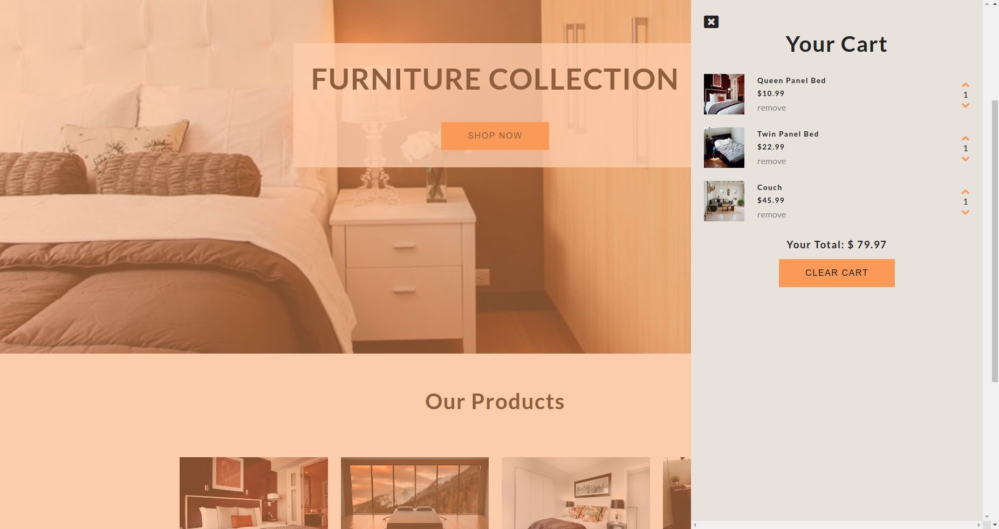

# Newsweek Replica

>This is a cart app built with HTML, CSS & JavaScript

## Built With

- HTML,CSS,
- JavaScript

## Live Demo

[Live Demo Link](https://raw.githack.com/MouhaDiouf/newsweek_replica/development/index.html)

## Author

👤 **Mouhamadou Diouf**

- Github: [@MouhaDiouf](https://github.com/MouhaDiouf)
- Twitter: [@mouhamadiouf](https://twitter.com/mouhamadiouf)
- Linkedin: [Mouhadiouf](https://linkedin.com/mouhadiouf)

## Usage 
### Clone it
> Clone the project with the command: git clone https://github.com/MouhaDiouf/comfy-house/
### Launch it 
> Launch it with a live server from your terminal.

## 🤝 Contributing

Contributions, issues, and feature requests are welcome!

1. Fork it (https://github.com/MouhaDiouf/comfy-house)
2. Create your feature branch (git checkout -b feature/[choose-a-name])
3. Commit your changes (git commit -am 'What this commit will fix/add')
4. Push to the branch (git push origin feature/[chosen name])
5. Create a new Pull Request

## Show your support

Give a ⭐️ if you like this project!
